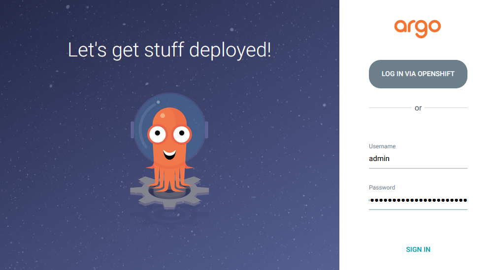

# ocp-gitops

To apply cluster configuration by GitOps, there are two options available:
- Utilize the Red Hat OpenShift GitOps operator (ArgoCD) by applying the application resource and monitoring cluster configurationa. [Click](#option-1-red-hat-openshift-gitops-operator-for-apply-cluster-configuration)
- Apply by the kustomization without Red Hat OpenShift GitOps operator (ArgoCD). [Click](#option-2-apply-the-kustomization-without-red-hat-openshift-gitops-operator-argocd)

### Improtant Note

The 'overlays/demo' folder has already undergone testing and verification on https://demo.redhat.com.

To apply these changes to your environment, please copy or duplicate the 'overlays/demo' and 'applications/demo' folder and customize the configurations to align with your specific environment.

### Currently support for GitOps cluster configuration.
- registry - Configuring block registry storage.
- monitoring - Creating a cluster monitoring config map and Configuring persistent storage for the monitoring stack.
- logging elasticsearch - Install OpenShift Elasticsearch, cluster-logging operators and Creating clusterLogging, clusterLogForwarder 
- project template - Create a template for the creation of new projects.
- chrony time service - Configuring chrony time service for sync time with NTP servers.
- node timezone - Configuring timezone for nodes

### Requirements
- OpenShift 4.X
- Git repository (Ex. GitLab, Github)

### Clone repository

```
$ git config --global user.name "Your username"
$ git config --global user.email "Your Email"
$ git clone https://github.com/cheevatee/ocp-gitops.git
$ ls -l ocp-gitops
total 0
drwxr-xr-x. 11 lab-user users 214 Mar 28 08:06 ocp-gitops
```
### Option 1: Red Hat OpenShift GitOps operator for apply cluster configuration
**Install Red Hat OpenShift GitOps operator**
```
$ cd ocp-gitops
$ oc apply -k openshift-gitops/overlays/all/
```

Output
```
clusterrole.rbac.authorization.k8s.io/gitops-imageregistry-role created
clusterrole.rbac.authorization.k8s.io/gitops-logging-role created
clusterrole.rbac.authorization.k8s.io/gitops-machineconfig-role created
clusterrole.rbac.authorization.k8s.io/gitops-template-role created
clusterrolebinding.rbac.authorization.k8s.io/gitops-imageregistry-rolebinding created
clusterrolebinding.rbac.authorization.k8s.io/gitops-logging-rolebinding created
clusterrolebinding.rbac.authorization.k8s.io/gitops-machineconfig-rolebinding created
clusterrolebinding.rbac.authorization.k8s.io/gitops-template-rolebinding created
subscription.operators.coreos.com/openshift-gitops-operator created
```

Check Red Hat OpenShift GitOps operator installed.

```
$ oc get csv -A|grep -i openshift-gitops-operator
default                                            openshift-gitops-operator.v1.5.10   Red Hat OpenShift GitOps           1.5.10    openshift-gitops-operator.v1.5.9   Succeeded
kube-node-lease                                    openshift-gitops-operator.v1.5.10   Red Hat OpenShift GitOps           1.5.10    openshift-gitops-operator.v1.5.9   Succeeded
kube-public                                        openshift-gitops-operator.v1.5.10   Red Hat OpenShift GitOps           1.5.10    openshift-gitops-operator.v1.5.9   Succeeded
kube-system                                        openshift-gitops-operator.v1.5.10   Red Hat OpenShift GitOps           1.5.10    openshift-gitops-operator.v1.5.9   Succeeded
...
..
.
$ oc get po -n openshift-operators
NAME                                                 READY   STATUS    RESTARTS   AGE
gitops-operator-controller-manager-c456f5b8b-prg2n   1/1     Running   0          14m
$ oc get po -n openshift-gitops
NAME                                                          READY   STATUS    RESTARTS   AGE
cluster-8548b895cc-7tcs4                                      1/1     Running   0          15m
kam-55d4bf4647-5xs92                                          1/1     Running   0          15m
openshift-gitops-application-controller-0                     1/1     Running   0          13m
openshift-gitops-applicationset-controller-54cd79848f-tr6dg   1/1     Running   0          13m
openshift-gitops-dex-server-6884b77ddc-6g225                  1/1     Running   0          15m
openshift-gitops-redis-688b9fd88f-5snn5                       1/1     Running   0          13m
openshift-gitops-repo-server-56759b7b95-qzdlt                 1/1     Running   0          13m
openshift-gitops-server-56d7468bf-w2vtv                       1/1     Running   0          13m
$ oc get argocd -n openshift-gitops
NAME               AGE
openshift-gitops   60m
$
```

Access argocd via route
```
$ oc get route -n openshift-gitops|grep -i openshift-gitops-server-openshift-gitops
openshift-gitops-server   openshift-gitops-server-openshift-gitops.apps.<clusterID>.<base-domain>          openshift-gitops-server   https   passthrough/Redirect   None
```

Get argocd admin password
```
$ oc extract secret/openshift-gitops-cluster --to=- -n openshift-gitops
# admin.password
5OvePcxW0p4KHSf6
```

Login with admin user and password




**Config Private Repositories that require a username and password.**

Navigate to Settings/Repositories


Click Connect Repo using HTTPS button and enter credentials


Click Connect to test the connection and have the repository added


**Create application resources**

Create argocd application for apply cluster configuration.
```
$ cd ocp-gitops
$ oc create -f applications/demo/registry.yaml
application.argoproj.io/registry created
$
```

Check argocd application status via CLI.
```
$ oc get application -n openshift-gitops
NAME       SYNC STATUS   HEALTH STATUS
registry   Synced        Healthy
$
```
or web UI


Check image registry pod already applied new configuration with block storage.

```
$ oc get po,pvc -n openshift-image-registry
NAME                                                  READY   STATUS    RESTARTS   AGE
pod/cluster-image-registry-operator-97d9bfbdd-gncds   1/1     Running   0          84m
pod/image-registry-597bbbf8bf-vnq9j                   1/1     Running   0          88m
pod/node-ca-7g8ml                                     1/1     Running   2          3h14m
pod/node-ca-bbbz5                                     1/1     Running   2          3h14m
pod/node-ca-k5mch                                     1/1     Running   2          3h14m
pod/node-ca-krxfj                                     1/1     Running   2          3h14m
pod/node-ca-pcl5j                                     1/1     Running   2          3h14m
pod/node-ca-q2dxf                                     1/1     Running   2          3h14m

NAME                                           STATUS   VOLUME                                     CAPACITY   ACCESS MODES   STORAGECLASS   AGE
persistentvolumeclaim/image-registry-storage   Bound    pvc-e5d4543e-abbc-4c5a-a319-46c187059105   200Gi      RWO            gp3-csi        123m
```

Here is an example to create multiple applications.


### Option 2: Apply the kustomization without Red Hat OpenShift GitOps operator (ArgoCD)

Use oc command with option apply -k to apply cluster configuration.

```
$ cd ocp-gitops
$ oc apply -k registry/overlays/demo/
persistentvolumeclaim/image-registry-storage created
Warning: resource configs/cluster is missing the kubectl.kubernetes.io/last-applied-configuration annotation which is required by oc apply. oc apply should only be used on resources created declaratively by either oc create --save-config or oc apply. The missing annotation will be patched automatically.
config.imageregistry.operator.openshift.io/cluster configured
```

Check image registry pod already applied new configuration with block storage.

```
$ oc get po,pvc -n openshift-image-registry
NAME                                                  READY   STATUS    RESTARTS   AGE
pod/cluster-image-registry-operator-97d9bfbdd-gncds   1/1     Running   0          90m
pod/image-registry-597bbbf8bf-vnq9j                   1/1     Running   0          94m
pod/node-ca-7g8ml                                     1/1     Running   2          3h20m
pod/node-ca-bbbz5                                     1/1     Running   2          3h20m
pod/node-ca-k5mch                                     1/1     Running   2          3h20m
pod/node-ca-krxfj                                     1/1     Running   2          3h20m
pod/node-ca-pcl5j                                     1/1     Running   2          3h20m
pod/node-ca-q2dxf                                     1/1     Running   2          3h20m

NAME                                           STATUS   VOLUME                                     CAPACITY   ACCESS MODES   STORAGECLASS   AGE
persistentvolumeclaim/image-registry-storage   Bound    pvc-e5d4543e-abbc-4c5a-a319-46c187059105   200Gi      RWO            gp3-csi        129m
$
```

Example command for apply cluster configuration

```
$ cd ocp-gitops
$ oc apply -k registry/overlays/demo/
$ oc apply -k monitoring/overlays/demo/
$ oc apply -k logging-elasticsearch/overlays/demo/
$ oc apply -k project-template/overlays/demo/
$ oc apply -k chrony-time-service/overlays/demo/
$ oc apply -k node-timezone/overlays/demo/
```
